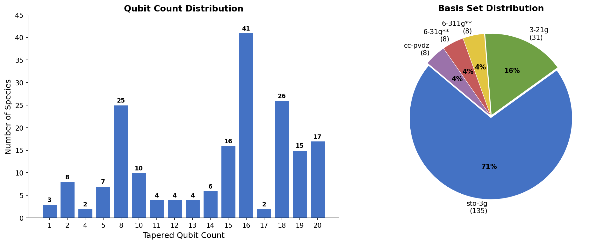

# Symmer-Hamiltonian Data Report

*Generated 2026-03-11 | Partition: `singlet`*

---

## Contents

1. [Introduction](#introduction)
2. [Methodology](#methodology)
3. [Hamiltonian Index](#hamiltonian-index)
4. [Dissociation Curves](#dissociation-curves)

---

<h2 id="introduction">1. Introduction</h2>

This report documents a database of Jordan-Wigner-encoded molecular electronic Hamiltonians for quantum computing research. The dataset covers **190** species across **1,594** Hamiltonians in the singlet ($2S+1 = 1$) spin partition, stored in the native [Symmer](https://github.com/UCL-CCS/symmer) `PauliwordOp` format.

Individual dissociation curves for all 156 multi-atom species are in the [Plot Gallery](figures/plot_gallery.md).

Total generation time: ~62 min.

[&uarr; Back to Contents](#contents)

---

<h2 id="methodology">2. Methodology</h2>

### 2.1 Pipeline Overview

Each Hamiltonian in this database is produced by the following pipeline:

1. **Geometry sourcing.** Equilibrium nuclear coordinates are retrieved from one of three repositories: [NIST CCCBDB](https://github.com/Kee-Wang/NIST-CCCBDB-database-mirror), PennyLane molecular datasets, or the Symmer reference collection. Species are included only if the tapered qubit count is ≤ 20.
2. **Geometry scaling.** For multi-atom species, the equilibrium geometry is uniformly scaled by a factor $\alpha \in \{0.5, 0.7, 0.8, 0.9, 1.0, 1.2, 1.5, 2.0, 2.5, 3.0\}$ to sample the dissociation coordinate. Single-atom species use $\alpha = 1.0$ only.
3. **Self-consistent field (SCF) calculation.** A restricted Hartree-Fock calculation is performed using PySCF with a three-stage convergence cascade (see Section 2.2).
4. **Post-Hartree-Fock methods.** Starting from the converged HF orbitals, the following correlated methods are run in sequence: MP2, CISD, CCSD, and FCI (full configuration interaction).  FCI provides the exact energy within the chosen basis set and serves as the ground-truth reference for quantum-algorithm benchmarks.
5. **Jordan-Wigner encoding.** The second-quantised fermionic Hamiltonian is mapped to a qubit Hamiltonian via the Jordan-Wigner transformation, implemented by Symmer.
6. **Qubit tapering metadata.** $\mathbb{Z}_2$ symmetries of the qubit Hamiltonian are identified via Symmer; the achievable tapered qubit count is recorded as metadata in [`species_list.json`](../data/singlet/species_list.json). Only species with tapered qubit count ≤ 20 are included in the dataset. The stored Hamiltonians remain in the full, untapered Jordan-Wigner form.

### 2.2 SCF Convergence Cascade

Obtaining a stable Hartree-Fock solution is critical because all post-HF methods depend on the HF orbitals.  The pipeline applies three stages in sequence, stopping at the first that converges:

| Stage | Method | Description |
|------:|--------|-------------|
| 1 | Standard SCF (DIIS) | Default PySCF solver with density-matrix propagation from the nearest converged geometry |
| 2 | Level-shifted SCF | Applies a $0.5\,E_h$ level shift to virtual orbitals to stabilise convergence, then removes it |
| 3 | Newton second-order SCF | Second-order orbital optimisation; most robust but slowest |

The stage that succeeded is recorded in the `hf_method_fallback` field of each Hamiltonian JSON file.

### 2.3 Density-Matrix Propagation

For dissociation curves, geometries are processed in order of increasing distance from equilibrium.  The converged density matrix from the previous geometry is used as the initial guess for the next, providing continuity of the electronic state and significantly improving SCF convergence at stretched geometries.

[&uarr; Back to Contents](#contents)

---

<h2 id="hamiltonian-index">3. Hamiltonian Index</h2>

All 190 species entries in alphabetical order. Each row is one (molecule_id, basis) pair.

- **Molecule** column: sequential index 1–190 (alphabetical by molecule ID, then basis).
- **Hamiltonian** column: single number for single-atom species (1 geometry); range {*start*,...,*end*} for multi-atom species (10 $\alpha$ points).
- **†** marks species where CISD energy falls below FCI by more than 1 μHa at one or more $\alpha$ points (variational bounds violation, 40 points across 10 species).

> ❗ **Caution:** Since FCI is exact within the basis set, CISD < FCI indicates the FCI eigensolver did not fully converge — the reported FCI energies at those points should be treated as **unreliable**.

| Molecule | Molecule ID | Basis | Stored Qubits | Tapered Qubits | Hamiltonian |
|---------:|-------------|-------|-------------:|---------------:|------------:|
| 1 | Al+_singlet_Kh | `sto-3g` | 18 | 16 | 1 |
| 2 | Al-_singlet_Kh | `sto-3g` | 18 | 16 | 2 |
| 3 | AlH2+_singlet_C2v | `sto-3g` | 22 | 18 | {3,...,12} |
| 4 | AlH2-_singlet_C2v | `sto-3g` | 22 | 18 | {13,...,22} |
| 5 | AlH3_singlet_D3h | `sto-3g` | 24 | 20 | {23,...,32} |
| 6 | AlH_singlet_Coov | `sto-3g` | 20 | 16 | {33,...,42} |
| 7 | ArH+_singlet_C1 | `sto-3g` | 20 | 18 | {43,...,52} |
| 8 | ArH2_singlet_Coov | `sto-3g` | 22 | 18 | {53,...,62} |
| 9 | Ar_singlet_Kh | `sto-3g` | 18 | 16 | 63 |
| 10 | B+_singlet_Kh | `3-21g` | 18 | 16 | 64 |
| 11 | B+_singlet_Kh | `sto-3g` | 10 | 8 | 65 |
| 12 | B2H2_singlet_Dooh | `sto-3g` | 24 | 19 | {66,...,75} † |
| 13 | BF_singlet_Coov | `sto-3g` | 20 | 16 | {76,...,85} |
| 14 | BH2+_singlet_C2v | `sto-3g` | 14 | 10 | {86,...,95} |
| 15 | BH2N_singlet_Coov | `sto-3g` | 24 | 20 | {96,...,105} |
| 16 | BH3_singlet_C2v | `sto-3g` | 16 | 12 | {106,...,115} |
| 17 | BH4-_singlet_D2d | `sto-3g` | 18 | 14 | {116,...,125} |
| 18 | BHO_singlet_Coov | `sto-3g` | 22 | 18 | {126,...,135} |
| 19 | BH_singlet_Coov | `3-21g` | 22 | 18 | {136,...,145} |
| 20 | BH_singlet_Coov | `sto-3g` | 12 | 8 | {146,...,155} |
| 21 | BO+_singlet_Coov | `sto-3g` | 20 | 16 | {156,...,165} |
| 22 | BO-_singlet_Coov | `sto-3g` | 20 | 16 | {166,...,175} |
| 23 | Be2_singlet_Dooh | `sto-3g` | 20 | 15 | {176,...,185} |
| 24 | BeF+_singlet_Coov | `sto-3g` | 20 | 16 | {186,...,195} |
| 25 | BeF-_singlet_Coov | `sto-3g` | 20 | 16 | {196,...,205} |
| 26 | BeH+_singlet_Coov | `3-21g` | 22 | 18 | {206,...,215} |
| 27 | BeH+_singlet_Coov | `sto-3g` | 12 | 8 | {216,...,225} |
| 28 | BeH-_singlet_Coov | `3-21g` | 22 | 18 | {226,...,235} |
| 29 | BeH-_singlet_Coov | `sto-3g` | 12 | 8 | {236,...,245} |
| 30 | BeH2_singlet_Dooh | `sto-3g` | 14 | 10 | {246,...,255} |
| 31 | BeN-_singlet_Coov | `sto-3g` | 20 | 16 | {256,...,265} |
| 32 | BeO_singlet_Coov | `sto-3g` | 20 | 16 | {266,...,275} |
| 33 | Be_singlet_Kh | `3-21g` | 18 | 16 | 276 |
| 34 | Be_singlet_Kh | `sto-3g` | 10 | 8 | 277 |
| 35 | C2H-_singlet_Cs | `sto-3g` | 22 | 19 | {278,...,287} |
| 36 | C2H2_singlet_C2v | `sto-3g` | 24 | 20 | {288,...,297} |
| 37 | C2H2_singlet_Dooh | `sto-3g` | 24 | 19 | {298,...,307} |
| 38 | C2_singlet_Dooh | `sto-3g` | 20 | 15 | {308,...,317} |
| 39 | CD4_singlet_Td | `sto-3g` | 18 | 14 | {318,...,327} |
| 40 | CF+_singlet_Coov | `sto-3g` | 20 | 16 | {328,...,337} |
| 41 | CH+_singlet_Coov | `3-21g` | 22 | 18 | {338,...,347} |
| 42 | CH+_singlet_Coov | `sto-3g` | 12 | 8 | {348,...,357} |
| 43 | CH-_singlet_Coov | `3-21g` | 22 | 18 | {358,...,367} † |
| 44 | CH-_singlet_Coov | `sto-3g` | 12 | 8 | {368,...,377} † |
| 45 | CH2D2_singlet_C2v | `sto-3g` | 18 | 14 | {378,...,387} |
| 46 | CH2N+_singlet_C2v | `sto-3g` | 24 | 20 | {388,...,397} |
| 47 | CH2N+_singlet_C2v_2 | `sto-3g` | 24 | 20 | {398,...,407} |
| 48 | CH2O_singlet_C2v | `sto-3g` | 24 | 20 | {408,...,417} |
| 49 | CH3+_singlet_D3h | `sto-3g` | 16 | 12 | {418,...,427} |
| 50 | CH3-_singlet_D3h | `sto-3g` | 16 | 12 | {428,...,437} |
| 51 | CH3D_singlet_C3v | `sto-3g` | 18 | 15 | {438,...,447} |
| 52 | CH4_singlet_Td | `sto-3g` | 18 | 14 | {448,...,457} |
| 53 | CHD3_singlet_C3v | `sto-3g` | 18 | 15 | {458,...,467} |
| 54 | CHF_singlet_Cs | `sto-3g` | 22 | 19 | {468,...,477} |
| 55 | CHN_singlet_Coov | `sto-3g` | 22 | 18 | {478,...,487} |
| 56 | CHN_singlet_Coov_2 | `sto-3g` | 22 | 18 | {488,...,497} |
| 57 | CHO+_singlet_Cs | `sto-3g` | 22 | 19 | {498,...,507} † |
| 58 | CHO+_singlet_Cs_2 | `sto-3g` | 22 | 19 | {508,...,517} |
| 59 | CHO-_singlet_Cs | `sto-3g` | 22 | 19 | {518,...,527} † |
| 60 | CN+_singlet_Coov | `sto-3g` | 20 | 16 | {528,...,537} |
| 61 | CN-_singlet_Coov | `sto-3g` | 20 | 16 | {538,...,547} |
| 62 | CO_singlet_Coov | `sto-3g` | 20 | 16 | {548,...,557} |
| 63 | Cl-_singlet_Kh | `sto-3g` | 18 | 16 | 558 |
| 64 | ClD_singlet_Coov | `sto-3g` | 20 | 16 | {559,...,568} |
| 65 | ClH2+_singlet_C1 | `sto-3g` | 22 | 20 | {569,...,578} |
| 66 | ClH_singlet_Coov | `sto-3g` | 20 | 16 | {579,...,588} |
| 67 | D2O_singlet_C2v | `sto-3g` | 14 | 10 | {589,...,598} |
| 68 | D2S_singlet_C2v | `sto-3g` | 22 | 18 | {599,...,608} |
| 69 | D2_singlet_Dooh | `3-21g` | 8 | 5 | {609,...,618} |
| 70 | D2_singlet_Dooh | `6-311g**` | 24 | 19 | {619,...,628} |
| 71 | D2_singlet_Dooh | `6-31g**` | 20 | 15 | {629,...,638} |
| 72 | D2_singlet_Dooh | `cc-pvdz` | 20 | 15 | {639,...,648} |
| 73 | D2_singlet_Dooh | `sto-3g` | 4 | 2 | {649,...,658} |
| 74 | D3N_singlet_C3v | `sto-3g` | 16 | 13 | {659,...,668} |
| 75 | DF_singlet_Coov | `3-21g` | 22 | 18 | {669,...,678} |
| 76 | DF_singlet_Coov | `sto-3g` | 12 | 8 | {679,...,688} |
| 77 | DHO_singlet_Cs | `sto-3g` | 14 | 11 | {689,...,698} |
| 78 | DH_singlet_Coov | `3-21g` | 8 | 5 | {699,...,708} |
| 79 | DH_singlet_Coov | `6-311g**` | 24 | 20 | {709,...,718} |
| 80 | DH_singlet_Coov | `6-31g**` | 20 | 16 | {719,...,728} |
| 81 | DH_singlet_Coov | `cc-pvdz` | 20 | 16 | {729,...,738} |
| 82 | DH_singlet_Coov | `sto-3g` | 4 | 2 | {739,...,748} |
| 83 | F-_singlet_Kh | `3-21g` | 18 | 16 | 749 |
| 84 | F-_singlet_Kh | `sto-3g` | 10 | 8 | 750 |
| 85 | F2H+_singlet_C1 | `sto-3g` | 22 | 20 | {751,...,760} † |
| 86 | F2H-_singlet_Dooh | `sto-3g` | 22 | 17 | {761,...,770} |
| 87 | F2_singlet_Dooh | `sto-3g` | 20 | 15 | {771,...,780} |
| 88 | FH2+_singlet_C1 | `sto-3g` | 14 | 12 | {781,...,790} |
| 89 | FHO_singlet_Cs | `sto-3g` | 22 | 19 | {791,...,800} |
| 90 | FH_singlet_Coov | `3-21g` | 22 | 18 | {801,...,810} |
| 91 | FH_singlet_Coov | `sto-3g` | 12 | 8 | {811,...,820} |
| 92 | FLi_singlet_Coov | `sto-3g` | 20 | 16 | {821,...,830} |
| 93 | FO+_singlet_Coov | `sto-3g` | 20 | 16 | {831,...,840} |
| 94 | FO-_singlet_Coov | `sto-3g` | 20 | 16 | {841,...,850} |
| 95 | H+_singlet_Kh | `3-21g` | 4 | 2 | 851 |
| 96 | H+_singlet_Kh | `6-311g**` | 12 | 10 | 852 |
| 97 | H+_singlet_Kh | `6-31g**` | 10 | 8 | 853 |
| 98 | H+_singlet_Kh | `cc-pvdz` | 10 | 8 | 854 |
| 99 | H+_singlet_Kh | `sto-3g` | 2 | 1 | 855 |
| 100 | H-_singlet_Kh | `3-21g` | 4 | 2 | 856 |
| 101 | H-_singlet_Kh | `6-311g**` | 12 | 10 | 857 |
| 102 | H-_singlet_Kh | `6-31g**` | 10 | 8 | 858 |
| 103 | H-_singlet_Kh | `cc-pvdz` | 10 | 8 | 859 |
| 104 | H-_singlet_Kh | `sto-3g` | 2 | 1 | 860 |
| 105 | H10_singlet_Dooh | `sto-3g` | 20 | 15 | {861,...,870} |
| 106 | H2LiN_singlet_C2v | `sto-3g` | 24 | 20 | {871,...,880} |
| 107 | H2Mg_singlet_Dooh | `sto-3g` | 22 | 17 | {881,...,890} |
| 108 | H2N-_singlet_C2v | `sto-3g` | 14 | 10 | {891,...,900} |
| 109 | H2N2_singlet_C2h | `sto-3g` | 24 | 20 | {901,...,910} |
| 110 | H2N2_singlet_C2v | `sto-3g` | 24 | 20 | {911,...,920} |
| 111 | H2N2_singlet_C2v_2 | `sto-3g` | 24 | 20 | {921,...,930} |
| 112 | H2O2_singlet_C2h | `sto-3g` | 24 | 20 | {931,...,940} |
| 113 | H2O2_singlet_C2v | `sto-3g` | 24 | 20 | {941,...,950} |
| 114 | H2O_singlet_C2v | `sto-3g` | 14 | 10 | {951,...,960} |
| 115 | H2P+_singlet_C2v | `sto-3g` | 22 | 18 | {961,...,970} |
| 116 | H2P-_singlet_C2v | `sto-3g` | 22 | 18 | {971,...,980} |
| 117 | H2S_singlet_C2v | `sto-3g` | 22 | 18 | {981,...,990} |
| 118 | H2Si_singlet_C2v | `sto-3g` | 22 | 18 | {991,...,1000} |
| 119 | H2_singlet_Dooh | `3-21g` | 8 | 5 | {1001,...,1010} |
| 120 | H2_singlet_Dooh | `6-311g**` | 24 | 19 | {1011,...,1020} |
| 121 | H2_singlet_Dooh | `6-31g**` | 20 | 15 | {1021,...,1030} |
| 122 | H2_singlet_Dooh | `cc-pvdz` | 20 | 15 | {1031,...,1040} |
| 123 | H2_singlet_Dooh | `sto-3g` | 4 | 2 | {1041,...,1050} |
| 124 | H3+_singlet_C1 | `3-21g` | 12 | 10 | {1051,...,1060} |
| 125 | H3+_singlet_C1 | `sto-3g` | 6 | 4 | {1061,...,1070} |
| 126 | H3+_singlet_D3h | `3-21g` | 12 | 8 | {1071,...,1080} |
| 127 | H3+_singlet_D3h | `sto-3g` | 6 | 4 | {1081,...,1090} |
| 128 | H3N_singlet_C3v | `sto-3g` | 16 | 13 | {1091,...,1100} |
| 129 | H3N_singlet_Cs | `sto-3g` | 16 | 13 | {1101,...,1110} |
| 130 | H3O+_singlet_C1 | `sto-3g` | 16 | 14 | {1111,...,1120} |
| 131 | H3O+_singlet_C3v | `sto-3g` | 16 | 13 | {1121,...,1130} |
| 132 | H4N+_singlet_Td | `sto-3g` | 18 | 14 | {1131,...,1140} |
| 133 | H4_singlet_D4h | `3-21g` | 16 | 11 | {1141,...,1150} |
| 134 | H4_singlet_D4h | `sto-3g` | 8 | 5 | {1151,...,1160} |
| 135 | H4_singlet_Dooh | `3-21g` | 16 | 11 | {1161,...,1170} |
| 136 | H4_singlet_Dooh | `sto-3g` | 8 | 5 | {1171,...,1180} |
| 137 | H6_singlet_Dooh | `3-21g` | 24 | 19 | {1181,...,1190} |
| 138 | H6_singlet_Dooh | `sto-3g` | 12 | 8 | {1191,...,1200} |
| 139 | H8_singlet_Dooh | `sto-3g` | 16 | 11 | {1201,...,1210} |
| 140 | HHe+_singlet_Coov | `3-21g` | 8 | 5 | {1211,...,1220} |
| 141 | HHe+_singlet_Coov | `6-311g**` | 24 | 20 | {1221,...,1230} |
| 142 | HHe+_singlet_Coov | `6-31g**` | 20 | 16 | {1231,...,1240} |
| 143 | HHe+_singlet_Coov | `cc-pvdz` | 20 | 16 | {1241,...,1250} |
| 144 | HHe+_singlet_Coov | `sto-3g` | 4 | 2 | {1251,...,1260} |
| 145 | HLiO_singlet_Coov | `sto-3g` | 22 | 18 | {1261,...,1270} |
| 146 | HLi_singlet_Coov | `3-21g` | 22 | 18 | {1271,...,1280} |
| 147 | HLi_singlet_Coov | `sto-3g` | 12 | 8 | {1281,...,1290} |
| 148 | HMg+_singlet_Coov | `sto-3g` | 20 | 16 | {1291,...,1300} |
| 149 | HMg-_singlet_Coov | `sto-3g` | 20 | 16 | {1301,...,1310} |
| 150 | HN2+_singlet_Cs | `sto-3g` | 22 | 19 | {1311,...,1320} |
| 151 | HNO_singlet_Cs | `sto-3g` | 22 | 19 | {1321,...,1330} |
| 152 | HNO_singlet_Cs_2 | `sto-3g` | 22 | 19 | {1331,...,1340} |
| 153 | HN_singlet_Coov | `3-21g` | 22 | 18 | {1341,...,1350} † |
| 154 | HN_singlet_Coov | `sto-3g` | 12 | 8 | {1351,...,1360} † |
| 155 | HNa_singlet_Coov | `sto-3g` | 20 | 16 | {1361,...,1370} |
| 156 | HNe+_singlet_Coov | `3-21g` | 22 | 18 | {1371,...,1380} |
| 157 | HNe+_singlet_Coov | `sto-3g` | 12 | 8 | {1381,...,1390} |
| 158 | HO-_singlet_Coov | `3-21g` | 22 | 18 | {1391,...,1400} |
| 159 | HO-_singlet_Coov | `sto-3g` | 12 | 8 | {1401,...,1410} |
| 160 | HO2-_singlet_Coov | `sto-3g` | 22 | 18 | {1411,...,1420} † |
| 161 | HS-_singlet_Coov | `sto-3g` | 20 | 16 | {1421,...,1430} |
| 162 | HSi+_singlet_Coov | `sto-3g` | 20 | 16 | {1431,...,1440} |
| 163 | He2_singlet_Dooh | `3-21g` | 8 | 5 | {1441,...,1450} |
| 164 | He2_singlet_Dooh | `6-311g**` | 24 | 19 | {1451,...,1460} |
| 165 | He2_singlet_Dooh | `6-31g**` | 20 | 15 | {1461,...,1470} |
| 166 | He2_singlet_Dooh | `cc-pvdz` | 20 | 15 | {1471,...,1480} |
| 167 | He2_singlet_Dooh | `sto-3g` | 4 | 2 | {1481,...,1490} |
| 168 | HeLi+_singlet_C1 | `3-21g` | 22 | 20 | {1491,...,1500} |
| 169 | HeLi+_singlet_C1 | `sto-3g` | 12 | 10 | {1501,...,1510} |
| 170 | He_singlet_Kh | `3-21g` | 4 | 2 | 1511 |
| 171 | He_singlet_Kh | `6-311g**` | 12 | 10 | 1512 |
| 172 | He_singlet_Kh | `6-31g**` | 10 | 8 | 1513 |
| 173 | He_singlet_Kh | `cc-pvdz` | 10 | 8 | 1514 |
| 174 | He_singlet_Kh | `sto-3g` | 2 | 1 | 1515 |
| 175 | Li+_singlet_Kh | `3-21g` | 18 | 16 | 1516 |
| 176 | Li+_singlet_Kh | `sto-3g` | 10 | 8 | 1517 |
| 177 | Li-_singlet_Kh | `3-21g` | 18 | 16 | 1518 |
| 178 | Li-_singlet_Kh | `sto-3g` | 10 | 8 | 1519 |
| 179 | Li2_singlet_Dooh | `sto-3g` | 20 | 15 | {1520,...,1529} |
| 180 | LiNe+_singlet_C1 | `sto-3g` | 20 | 18 | {1530,...,1539} † |
| 181 | LiO-_singlet_Coov | `sto-3g` | 20 | 16 | {1540,...,1549} |
| 182 | Mg_singlet_Kh | `sto-3g` | 18 | 16 | 1550 |
| 183 | N2_singlet_Dooh | `sto-3g` | 20 | 15 | {1551,...,1560} |
| 184 | NO+_singlet_Coov | `sto-3g` | 20 | 16 | {1561,...,1570} |
| 185 | Na+_singlet_Kh | `sto-3g` | 18 | 16 | 1571 |
| 186 | Na-_singlet_Kh | `sto-3g` | 18 | 16 | 1572 |
| 187 | Ne2_singlet_Dooh | `sto-3g` | 20 | 15 | {1573,...,1582} |
| 188 | Ne_singlet_Kh | `3-21g` | 18 | 16 | 1583 |
| 189 | Ne_singlet_Kh | `sto-3g` | 10 | 8 | 1584 |
| 190 | O2--_singlet_Dooh | `sto-3g` | 20 | 15 | {1585,...,1594} |
| | | | | **Total** | **1594** |

[&uarr; Back to Contents](#contents)

---

<h2 id="dissociation-curves">4. Dissociation Curves</h2>

### Overview Grid

[&uarr; Back to Contents](#contents)

---

*End of data report -- 190 species, 1,594 Hamiltonians.*
